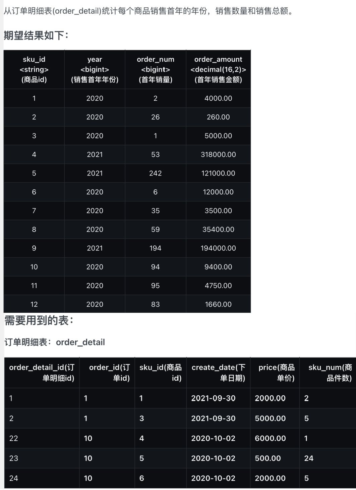

# 1~10 hive-sql例题

> 0001 查询累积销量排名第二的商品


```sql
select
    sku_id
from (
    select
        sku_id
        ,sku_num
        ,dense_rank() over(order by sku_num desc) as rk
    from (
        select
            sku_id
            ,sum(sku_num) as sku_num
        from order_detail 
        group by sku_id
    ) t1
) t2 where rk=2;
```
> 0002 查询至少连续三天下单的用户


```sql
select
    user_id
from (
         select
             user_id
              ,date_sub(create_date,rk) as dt
         from (
                  select
                      user_id
                       ,create_date
                       ,rank() over(partition by user_id order by create_date) as rk
                  from (
                           select user_id,create_date
                           from order_info
                           group by user_id,create_date
                       ) t1
              ) t2
     ) t3
group by user_id
having count(dt)>=3
;
```
> 0003 查询各品类销售商品的种类数及销量最高的商品


```sql
with details as (
    select
        d.order_id
         ,d.sku_num
         ,s.sku_id
         ,s.name
         ,c.category_id
         ,c.category_name
    from order_detail d
             join sku_info s
                  on d.sku_id=s.sku_id
             join category_info c
                  on s.category_id=c.category_id
),
cate_aggr as (
   SELECT
       category_id
        ,category_name
        ,count(distinct sku_id) as sku_cnt
   from details
   group by category_id,category_name
),
cate_hots as (
   select
       category_id
        ,category_name
        ,sku_id
        ,name
        ,sku_num as order_num
   from (
            select
                category_id
                 ,category_name
                 ,sku_id
                 ,name
                 ,sku_num
                 ,rank() over(partition by category_id,category_name order by sku_num desc) as rk
            from (
                     SELECT
                         category_id
                          ,category_name
                          ,sku_id
                          ,name
                          ,sum(sku_num) as sku_num
                     from details
                     group by category_id,category_name,sku_id,name
                 ) t1
        ) t2
   where rk=1
)

select
    h.category_id
     ,h.category_name
     ,h.sku_id
     ,h.name
     ,a.sku_cnt
     ,h.order_num
from cate_aggr a join cate_hots h on a.category_id=h.category_id
order by h.category_id;
```
> 0004 查询用户的累计消费金额及VIP等级


```sql
select 
	user_id
    ,create_date
    ,sum_so_far
    ,case when sum_so_far >=0 and sum_so_far < 10000 then '普通会员' 
    when sum_so_far < 30000 then '青铜会员' 
    when sum_so_far < 50000 then '白银会员' 
    when sum_so_far < 80000 then '黄金会员' 
    when sum_so_far < 100000 then '白金会员' 
    else '钻石会员' end as vip_level
from (
  select 
      user_id 
      ,create_date
      ,sum(total_amount) over(partition by user_id order by create_date rows between unbounded preceding and current row) as sum_so_far
  from (
    select 
      user_id,create_date,sum(total_amount) as total_amount
    from order_info
    group by user_id,create_date
  ) t0
) t1
order by user_id,create_date;
```
> 0005 查询首次下单后第二天连续下单的用户比率


```sql
with 
sales as (
  select 
  user_id
  ,create_date
  from order_info 
  group by user_id,create_date
),
total_users as (
  select 
  	count(distinct user_id) as user_cnt
  from sales 
),
ranks as (
  select 
  user_id
  ,create_date
  ,rank() over(partition by user_id order by create_date) as rk
  from sales
),
again_users as (
  select 
  	count(distinct r1.user_id) as again_cnt
  from 
  (select user_id,create_date from ranks where rk=1) r1 join
  (select user_id,create_date from ranks where rk=2) r2 
  on r1.user_id=r2.user_id and datediff(r2.create_date,r1.create_date)=1
)

select 
  concat(cast(round(again_cnt/user_cnt*100,1) as string),'%') as percentage
from total_users,again_users
```
> 0006 每个商品销售首年的年份、销售数量和销售金额


```sql
with 
first_sales as (
  select 
      sku_id
      ,min(year(create_date)) as year
  from order_detail 
  group by sku_id
)

select 
	d.sku_id
    ,f.year
    ,sum(sku_num) as order_num 
    ,sum(price * sku_num) as order_amount
from order_detail d join first_sales f 
on d.sku_id=f.sku_id and year(d.create_date)=f.year
group by d.sku_id,f.year;
```
> 0007 筛选去年总销量小于100的商品


```sql
select 
	sku_id
    ,name
    ,order_num
from (
  select 
  	  year(create_date) as year
      ,d.sku_id
      ,s.name
      ,sum(sku_num) as order_num
  from order_detail d join sku_info s on d.sku_id=s.sku_id
  where datediff('2022-01-10',s.from_date)>30
  group by year(create_date),d.sku_id,name
) t1 
where order_num<100 and year=2021;
```
> 0008 查询每日新用户数


```sql
select 
	login_date_first
    ,count(user_id) as user_count
from (
  select 
      user_id
      ,date(min(login_ts)) as login_date_first
  from user_login_detail 
  group by user_id
) temp 
group by login_date_first;
```
> 0009 统计每个商品的销量最高的日期


```sql
select 
	sku_id
    ,create_date
    ,sum_num
from (
  select 
      sku_id
      ,create_date
      ,sum_num
      ,rank() over(partition by sku_id order by sum_num desc,create_date asc) as rk
  from (
    select 
        sku_id
        ,create_date
        ,sum(sku_num) as sum_num
    from order_detail 
    group by sku_id,create_date
  ) t1
) t2
where rk=1;
```
> 0010 查询销售件数高于品类平均数的商品


```sql
with 
details as (
 select 
      s.category_id
  	  ,s.sku_id
      ,s.name
      ,sum(sku_num) as sum_num
  from order_detail d join sku_info s on d.sku_id=s.sku_id
  group by s.category_id,s.sku_id,s.name
),
cate_avg as (
  select 
      category_id
      ,cast(avg(sum_num) as bigint) as cate_avg_num -- 整形
  from details
  group by category_id
)
select 
	sku_id,name,sum_num,cate_avg_num
from details d join cate_avg c on d.category_id=c.category_id
where sum_num > cate_avg_num;
```
> 0011 用户注册、登录、下单综合统计


```sql
with login_info as (
  select 
      user_id
      ,date(min(login_ts)) as register_date
      ,sum(1) as total_login_count
      ,sum(if(year(login_ts)=2021,1,null)) as login_count_2021
  from user_login_detail
  group by user_id
),
order_2021 as (
  select 
  	user_id
  	,count(order_id) as order_count_2021
  	,sum(total_amount) as order_amount_2021
  from order_info 
  where year(create_date)=2021
  group by user_id
)

select 
	l.user_id
    ,register_date
    ,total_login_count
    ,login_count_2021
    ,order_count_2021
    ,order_amount_2021
from login_info l join order_2021 o on l.user_id=o.user_id;
```
> 0012 查询指定日期的全部商品价格


```sql
with modify_info as (
  select 
  	sku_id
    ,new_price
    ,change_date
  from (
    select 
      sku_id
      ,new_price
      ,change_date
      ,rank() over(partition by sku_id order by change_date desc) as rk
    from sku_price_modify_detail
    where change_date<='2021-10-01'
  ) t1
  where rk=1
)

select 
	s.sku_id
	,cast(if(m.sku_id is null or s.from_date>m.change_date,s.price,m.new_price) as decimal(16,2)) as price
from sku_info s left join modify_info m on s.sku_id=m.sku_id
;
```
> 0013 即时订单比例


```sql
select 
    cast(count(if(order_date=custom_date,order_id,null)) / count(order_id) as decimal(16,2)) as percentage
from (
  select 
      order_id,user_id,order_date,custom_date
      ,row_number() over(partition by user_id order by order_date) as rk -- 用row_number
  from delivery_info
) t1 
where rk=1;
```
> 0014 向用户推荐朋友收藏的商品


```sql
with my_favor as ( -- 我关注的
  select 
      s.user1_id as me,sku_id
  from friendship_info s join favor_info f on s.user1_id=f.user_id
),
friend_favor as ( -- 我朋友关注的 
  select 
      s.user1_id as me,s.user2_id as friend,sku_id
  from friendship_info s join favor_info f on s.user2_id=f.user_id
)
select 
	distinct me as user_id,sku_id
from friend_favor -- 我朋友关注的内容中不包含我关注的
where concat(cast(me as string),'-',cast(sku_id as string)) not in (
	select concat(cast(me as string),'-',cast(sku_id as string)) from my_favor
)
order by user_id
;
```
> 0015 查询所有用户的连续登录两天及以上的日期区间


```sql
select 
  user_id
  ,min(login_date) as start_date
  ,max(login_date) as end_date
from (
    select 
        user_id,login_date
        ,date_sub(login_date,rk) as dt 
    from (
      select 
          user_id,login_date,row_number() over(partition by user_id order by login_date) as rk
      from (
        select 
            distinct 
            user_id
            ,date(login_ts) as login_date
        from user_login_detail
      ) t1
    ) t2
) t3
group by user_id,dt
having count(dt)>=2;
```
> 0016 男性和女性每日的购物总金额统计


```sql
select 
	create_date
    ,sum(if(gender='男',total_amount,0)) as total_amount_male
    ,sum(if(gender='女',total_amount,0)) as total_amount_female
from order_info o join user_info u on o.user_id=u.user_id
group by create_date;
```
> 0017 订单金额趋势分析


```sql
select 
	create_date
    ,cast(sum(total_amount) over(order by create_date rows between 2 preceding and current row) as decimal(16,2)) as total_3d
    ,cast(avg(total_amount) over(order by create_date rows between 2 preceding and current row) as decimal(16,2)) as avg_3d
from (
  select 
      create_date,sum(total_amount) as total_amount
  from order_info
  group by create_date
) temp
;
```
> 0018 订单金额趋势分析


```sql
with details as (
   select 
  		user_id,sku_id
   from order_info o join order_detail d on o.order_id=d.order_id
),
buy_1 as (
	select user_id from details where sku_id=1
),
buy_2 as (
	select user_id from details where sku_id=2
)

select 
	b1.user_id
from buy_1 b1 join buy_2 b2 on b1.user_id=b2.user_id 
where b1.user_id not in (
	select user_id from details where sku_id=3
);
```
> 0019 统计每日商品1和商品2销量的差值


```sql
with details as (
  select 
      create_date,sku_id,sum(sku_num) as order_num
  from order_detail
  group by create_date,sku_id
),
buy_1 as (
  select create_date,order_num from details where sku_id=1
),
buy_2 as (
  select create_date,order_num from details where sku_id=2
)
select 
	coalesce(b1.create_date,b2.create_date) as create_date
    ,coalesce(b1.order_num,0) - coalesce(b2.order_num,0) as diff
from buy_1 b1 full join buy_2 b2 on b1.create_date=b2.create_date
;
```
> 0020 查询出每个用户的最近三笔订单


```sql
with recent3days as (
  select 
      user_id,create_date
  from (
    select 
        user_id,create_date,rank() over(partition by user_id order by create_date desc) as rk
    from (
      select 
          distinct user_id,create_date
      from order_info
    ) t0
  ) t1 
  where rk<=3
)
select 
	o.user_id,o.order_id,o.create_date
from order_info o join recent3days r 
on o.user_id=r.user_id and o.create_date=r.create_date
;
```