# 21~40 hive-sql例题

> 0021 查询每个用户登录日期的最大空档期

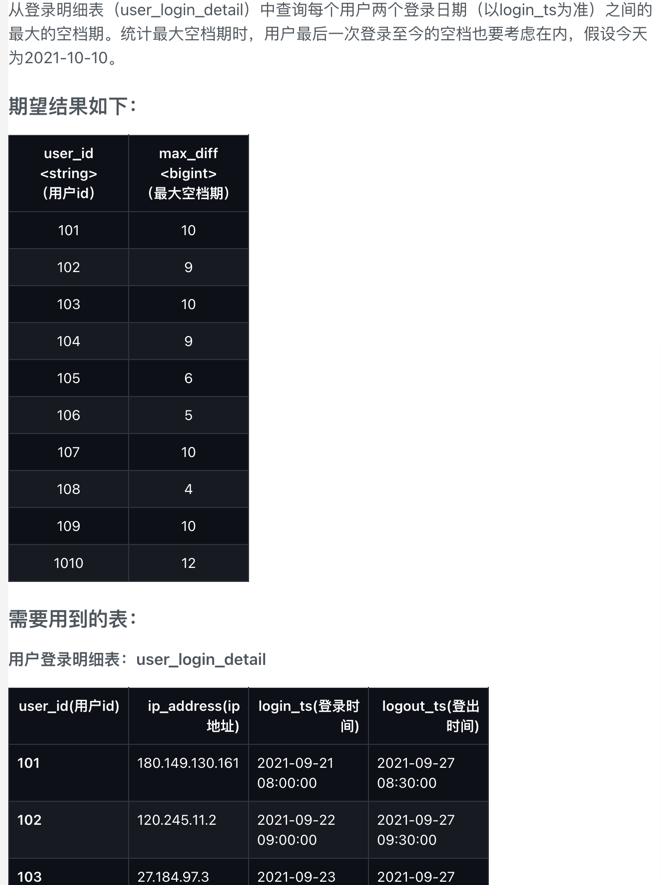
```sql
select 
	user_id
    ,max(datediff(next_login_date,login_date)) as max_diff
from (
    select 
        user_id,login_date
        -- lead(col,offset,default) 往后第offset条
        ,lead(login_date,1,date('2021-10-10')) over(partition by user_id order by login_date) as next_login_date
    from (
        select 
        user_id,date(login_ts) as login_date
        from user_login_detail
    ) t1
) t2 
group by user_id;
```
```sql
select 
	user_id
    ,max(datediff(login_date,prev_login_date)) as max_diff
from (
select 
  	user_id,login_date
    -- lag(col,offset,default)
    ,lag(login_date,1) over(partition by user_id order by login_date) as prev_login_date
from (
    select 
    user_id,date(login_ts) as login_date
    from user_login_detail
    union 
    select -- 补一条数据
    user_id,date('2021-10-10') as login_date
    from user_login_detail
) t1
) t2 
group by user_id;
```
> 0022 查询相同时刻多地登陆的用户

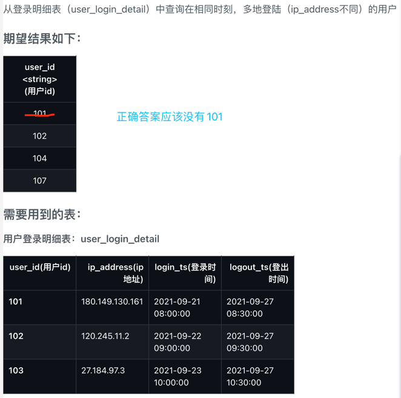
```sql
select 
	distinct l1.user_id
from user_login_detail l1 join user_login_detail l2 
on l1.user_id=l2.user_id 
and l1.ip_address!=l2.ip_address
and (
  (l1.login_ts <= l2.login_ts and l1.logout_ts >= l2.logout_ts) -- 1包2 
  or (l2.login_ts <= l1.login_ts and l2.logout_ts >= l1.logout_ts) -- 2包1  
  or (l1.login_ts <= l2.login_ts and l1.logout_ts >= l2.login_ts) -- 1、2穿插
  or (l2.login_ts <= l1.login_ts and l2.logout_ts >= l1.login_ts)
);
```
> 0023 销售额完成任务指标的商品

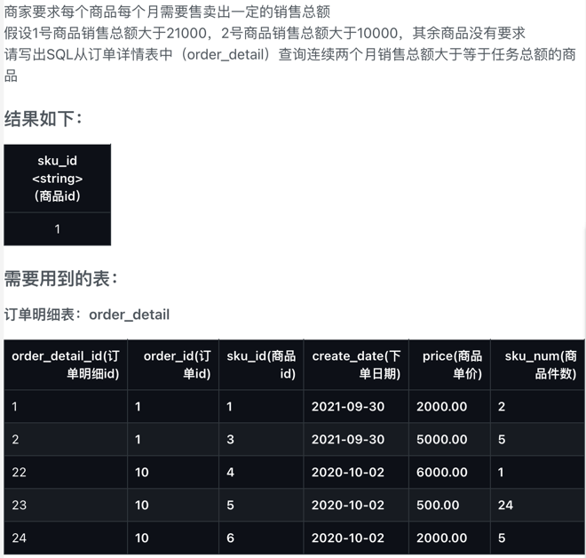
```sql
with 
tasks as (
	select '1' as sku_id,21000 as task union 
    select '2' as sku_id,10000 as task
)

select 
	distinct sku_id
from (
  select 
      t2.sku_id
      ,month
      ,amount -- lag(col,offset,default) 向前找第offset个
      ,lag(amount,1) over(partition by t2.sku_id order by month) as prev_amount
      ,t.task
  from (
    select 
        sku_id
        ,month
        ,sum(amount) as amount
    from
    (
      select 
          sku_id,month(create_date) as month,sku_num*price as amount
      from order_detail
    ) t1
    group by sku_id,month
  ) t2
  join tasks t on t2.sku_id=t.sku_id
) t3
where amount>task and prev_amount>task;
```
> 0024 根据商品销售情况进行商品分类

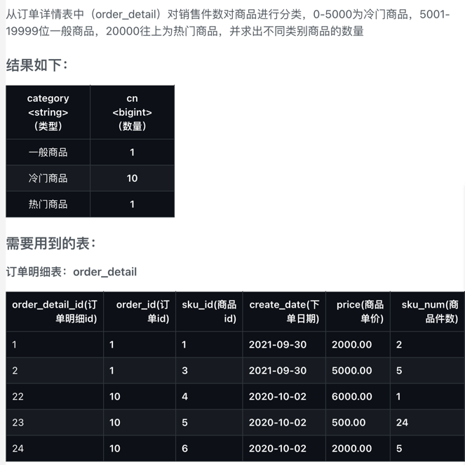
```sql
select 
	category,count(sku_id) as cn
from (
  select 
      sku_id
      ,case when order_num >= 0 and order_num <= 5000 then '冷门商品' 
      when order_num >= 5001 and order_num <= 19999 then '一般商品' 
      else '热门商品'end  as category
  from (
    select 
        sku_id,sum(sku_num) as order_num
    from order_detail 
    group by sku_id
  ) t1
) t2 
group by category
;
```
> 0025 各品类销量前三的所有商品

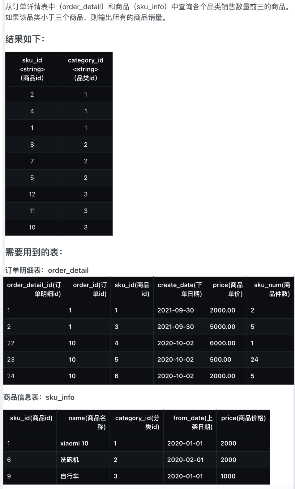
```sql
select 
	sku_id,category_id
from (
  select 
      sku_id,category_id,order_num
      ,rank() over(partition by category_id order by order_num desc) as rk
  from (
    select 
        d.sku_id,s.category_id,sum(sku_num) as order_num
    from order_detail d join sku_info s on d.sku_id=s.sku_id
    group by d.sku_id,s.category_id
  ) t1
) t2
where rk<=3;
```
> 0026 各品类销量前三的所有商品

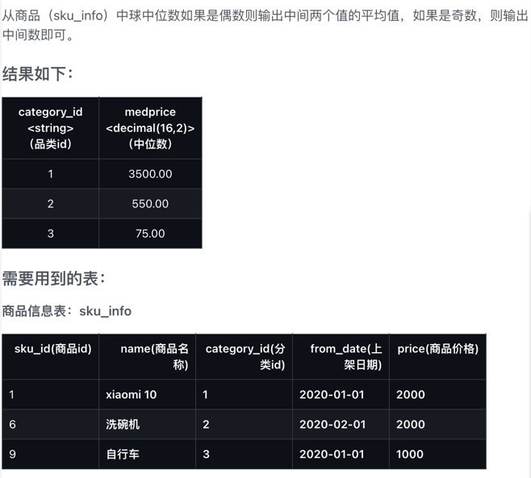
```sql
with prices as (
    select 
        category_id,price,rank() over(partition by category_id order by price) as rk
    from sku_info 
),
ranges as (
  select
	category_id
  	,if(rk_max%2=0,rk_max/2,(rk_max+1)/2) as down
    ,if(rk_max%2=0,(rk_max+2)/2,(rk_max+1)/2) as up
  from (
    select 
        category_id,max(rk) as rk_max
    from prices 
    group by category_id
  ) t1
)

select 
   p.category_id,cast(avg(p.price) as decimal(16,2)) as medprice
from prices p join ranges r on p.category_id=r.category_id and (p.rk>=r.down and p.rk<=r.up)
group by p.category_id
;
```
> 0027 找出销售额连续3天超过100的商品

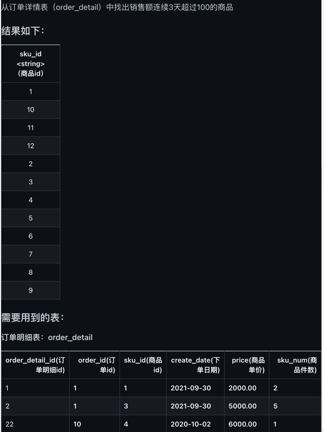
```sql
select 
	sku_id
from (
  select 
      create_date,sku_id,date_sub(create_date,rk) as dt
  from (
    select 
        create_date,sku_id,amt,rank() over(partition by sku_id order by create_date) as rk
    from (
      select 
          create_date,sku_id,sum(sku_num*price) as amt
      from order_detail
      group by create_date,sku_id
      having amt>100
    ) t1
  ) t2
) t3
group by sku_id
having count(dt)>=3
;
```
> 0028 查询有新注册用户的当天的新用户数量、新用户的第一天留存率

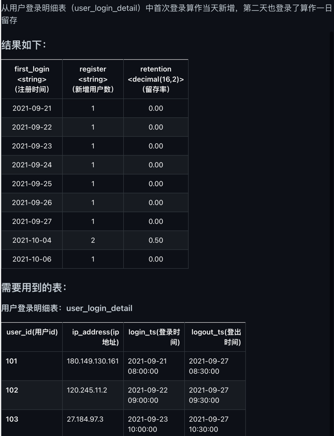
```sql
with ranks as (
  select 
      user_id,login_dt,rank() over(partition by user_id order by login_dt) as rk
  from (
    select 
        distinct user_id,date(login_ts) as login_dt
    from user_login_detail
  ) t1
),
first_login as (
	select user_id,login_dt from ranks where rk=1
),
second_login as (
	select user_id,login_dt from ranks where rk=2
)

select 
	first_login
    ,cast(`register` as string) as `register`
    ,cast(`remain`/`register` as decimal(16,2)) as `retention`
from (
  select 
      f.login_dt as first_login
      ,count(f.user_id) as `register`
      ,sum(if(datediff(s.login_dt,f.login_dt)=1,1,0)) as `remain`
  from first_login f left join second_login s on f.user_id=s.user_id
  group by f.login_dt
) t1;
```
> 0029 求出商品连续售卖的时间区间

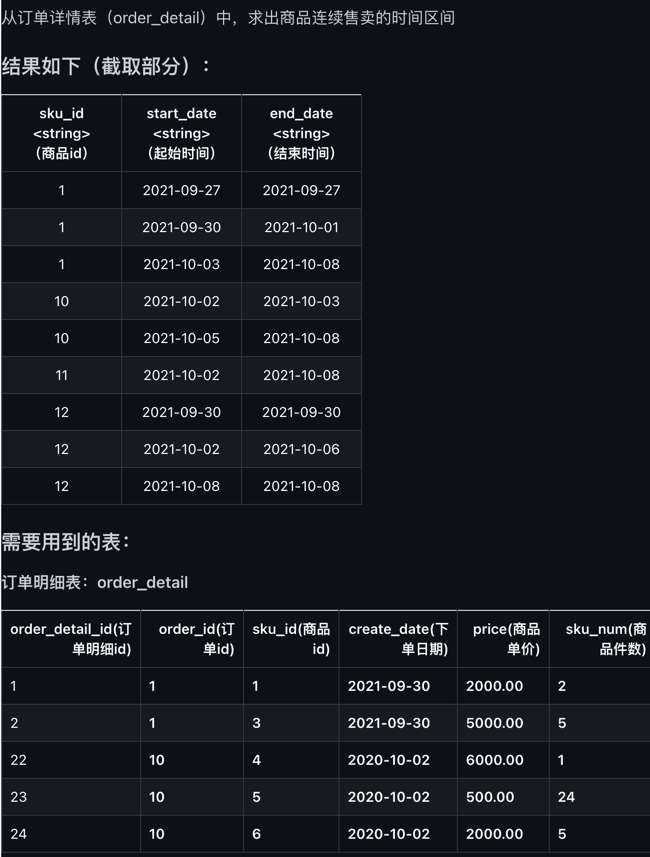
```sql
select 
	sku_id,min(create_date) as start_date,max(create_date) as end_date
from (
  select 
      sku_id,create_date,date_sub(create_date,rk) as dt
  from (
    select 
        sku_id,create_date,rank() over(partition by sku_id order by create_date) as rk
    from (
    select 
        sku_id,create_date
    from order_detail
    group by sku_id,create_date
    ) t1
  ) t2
) t3
group by sku_id,dt
order by sku_id,start_date
;
```
> 0030 登录次数及交易次数统计

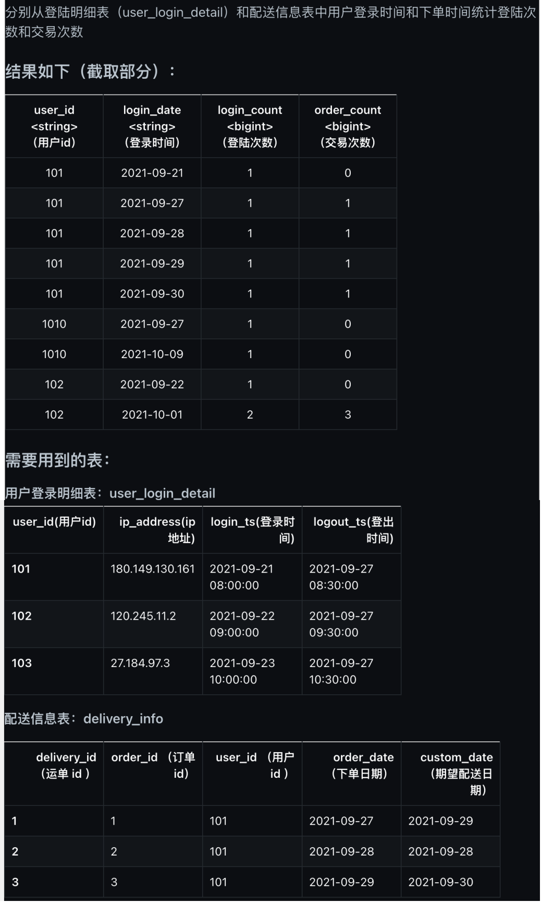
```sql
with login as (
	select 
  		user_id,date(login_ts) as login_date,count(1) as login_count
  	from user_login_detail
    group by user_id,date(login_ts)
),
sales as (
  select 
  	user_id,order_date,count(order_id) as order_count
  from delivery_info
  group by user_id,order_date
)

select 
	l.user_id,login_date,login_count,nvl(order_count,0) as order_count
from login l left join sales s 
on l.user_id=s.user_id and l.login_date=s.order_date
;
```
* 0031 按年度列出每个商品销售总额
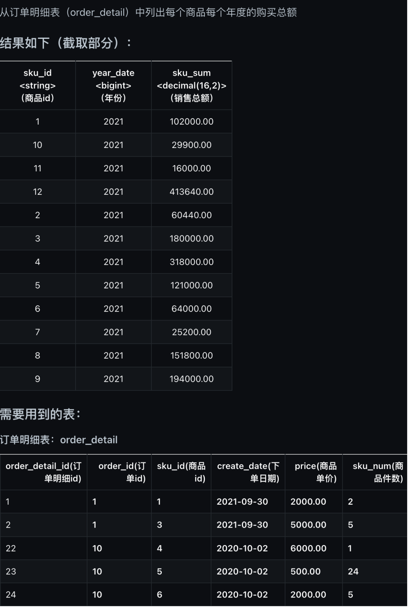
```sql
select 
	sku_id,year(create_date) as year_date,sum(sku_num*price) as sku_sum
from order_detail 
group by sku_id,year(create_date);
```
> 0032 某周内每件商品每天销售情况

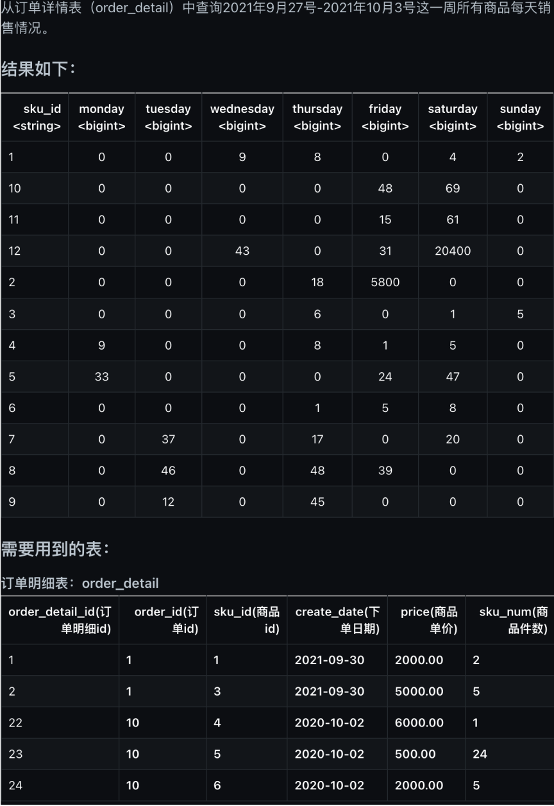
```sql
select 
	sku_id
	,sum(if(dayofweek(create_date)=2,sku_num,0)) as monday
    ,sum(if(dayofweek(create_date)=3,sku_num,0)) as tuesday
	,sum(if(dayofweek(create_date)=4,sku_num,0)) as wednesday
	,sum(if(dayofweek(create_date)=5,sku_num,0)) as thursday
    ,sum(if(dayofweek(create_date)=6,sku_num,0)) as friday
    ,sum(if(dayofweek(create_date)=7,sku_num,0)) as saturday
    ,sum(if(dayofweek(create_date)=1,sku_num,0)) as sunday -- 周日为一周的第一天
from order_detail 
where create_date between '2021-09-27' and '2021-10-03'
group by sku_id;
```
> 0033 查看每件商品的售价涨幅情况


```sql
with details as (
  select 
      sku_id,new_price,change_date
      ,rank() over(partition by sku_id order by change_date desc) as rk
  from sku_price_modify_detail
),
rk1 as (
	select sku_id,new_price from details where rk=1
),
rk2 as (
	select sku_id,new_price from details where rk=2
)

select 
	rk1.sku_id,(rk1.new_price-rk2.new_price) as price_change
from rk1 join rk2 on rk1.sku_id=rk2.sku_id
order by price_change;
```
> 0034 销售订单首购和次购分析

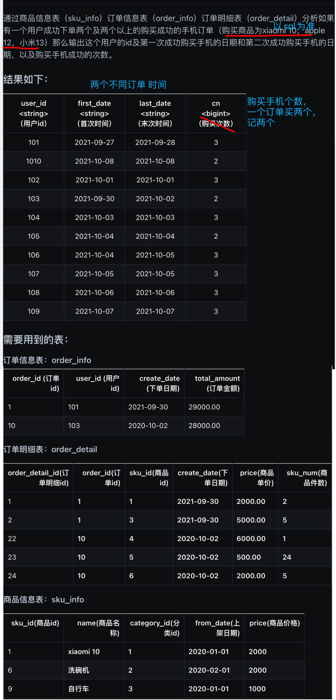
```sql
with details as (
  select 
      order_id,user_id,create_date,cnt
      ,rank() over(partition by user_id order by create_date) as rk
  from (
    select 
     o.order_id,o.user_id,d.create_date,count(1) as cnt
    from order_info o 
    join order_detail d on o.order_id=d.order_id
    join sku_info s on d.sku_id=s.sku_id
    where s.name in ('xiaomi 10','apple 12','xiaomi 13')
    group by o.order_id,o.user_id,d.create_date
  ) t1
),
 totals as (
 	select user_id,sum(cnt) as cn
     from details
     group by user_id
 )
 ,
 rks as (
   select user_id,min(create_date) as first_date,max(create_date) as last_date
   from details
   where rk in (1,2)
   group by user_id
 )
 
 select 
 	r.user_id,first_date,last_date,cn
 from rks r join totals t on r.user_id=t.user_id
 order by r.user_id;
```
> 0035 查看每件商品的售价涨幅情况

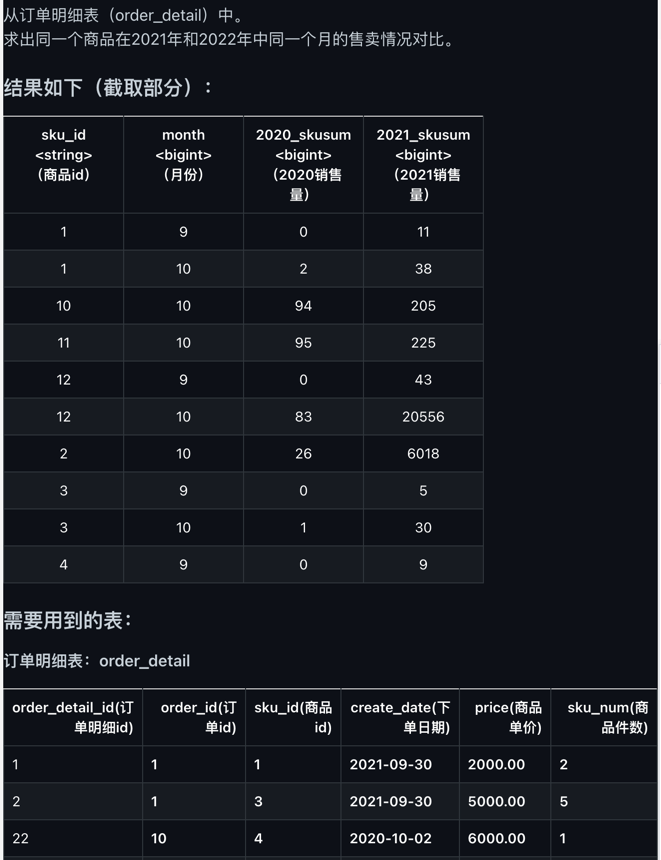
```sql
with sales as (
  select 
      sku_id
      ,year
      ,month
      ,sum(sku_num) as sku_sum
  from (
    select 
        sku_id,year(create_date) as year,month(create_date) as month,sku_num
    from order_detail 
  ) t1
  group by sku_id,year,month
),
sales_20 as (
	select sku_id,month,sku_sum from sales where year=2020
),
sales_21 as (
	select sku_id,month,sku_sum from sales where year=2021
)

select 
	coalesce(s0.sku_id,s1.sku_id) as sku_id
    ,coalesce(s0.month,s1.month) as month
    ,nvl(s0.sku_sum,0) as `2020_skusum` -- 必须使用 nvl 兼容join失败情况，否则json不输出为null的列
    ,nvl(s1.sku_sum,0)  as `2021_skusum`
from sales_20 s0 full join sales_21 s1 on s0.sku_id=s1.sku_id and s0.month=s1.month
;
```
> 0036 国庆期间每个品类的商品的收藏量和购买量

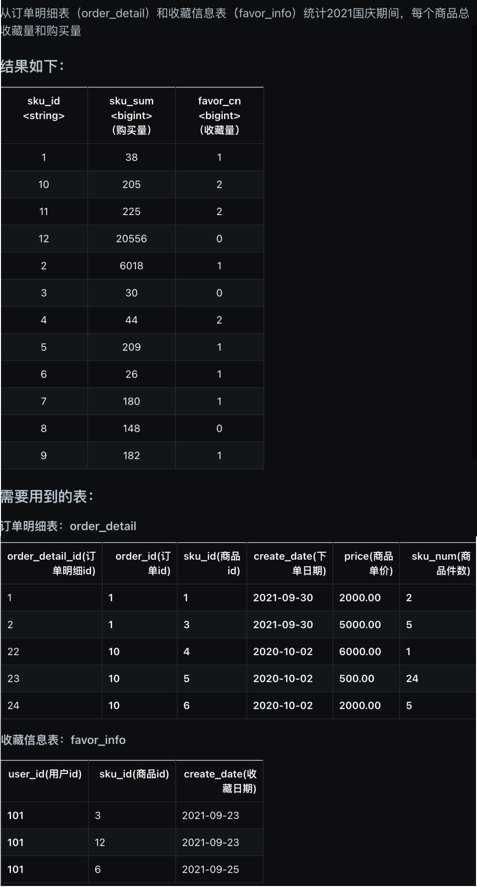
```sql
with sales as (
  select 
      sku_id
      ,sum(sku_num) as sku_sum
  from order_detail
  where create_date between '2021-10-01' and '2021-10-07'
  group by sku_id
),
favor as (
  select 
  	sku_id,count(1) as favor_cn
  from favor_info
  where create_date between '2021-10-01' and '2021-10-07'
  group by sku_id
)

select 
	coalesce(s.sku_id,f.sku_id) as sku_id
    ,nvl(sku_sum,0) as sku_sum
    ,nvl(favor_cn,0) as favor_cn
from sales s full join favor f on s.sku_id=f.sku_id
order by sku_id;
```
> 0037 统计活跃间隔对用户分级结果

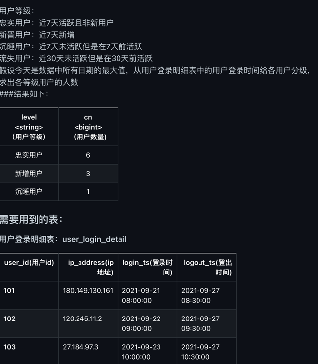
```sql
with today as (
	select max(date(login_ts)) as curr_dt from user_login_detail
),
login_info as (
  select 
      user_id,login_dt,curr_dt,rank() over(partition by user_id order by login_dt) as rk
  from (
  	select user_id,date(login_ts) as login_dt
  	from user_login_detail
  ) t1,today
),
newly_in_7 as (
  select 
	'新增用户' as level
  	,count(if(min_rk=1,user_id,null)) as cn
  from (
    select 
    	user_id,min(rk) as min_rk
    from login_info
    where login_dt >= date_sub(curr_dt,7) and login_dt <= curr_dt -- 理论上是 date_sub(curr_dt,6)
    group by user_id
  ) t1
),
active_notnew_7 as (
  select 
	'忠实用户' as level
  	,count(distinct if(min_rk=1,null,user_id)) as cn
  from (
    select 
    	user_id,min(rk) as min_rk
    from login_info
    where login_dt >= date_sub(curr_dt,7) and login_dt <= curr_dt
    group by user_id
  ) t1
),
active_out_7 as (
  select 
  	'沉睡用户' as level
  	,count(out7.user_id) as cn
  from
  (
    select 
     user_id
   from login_info
   where login_dt < date_sub(curr_dt,7)
   group by user_id
 ) out7
 left join 
 (
   select 
     user_id
   from login_info
   where login_dt >= date_sub(curr_dt,7) and login_dt <= curr_dt
   group by user_id
 ) in7 on out7.user_id=in7.user_id
 where in7.user_id is null 
),
active_out_30 as (
  select 
	'流失用户' as level
  	,count(out30.user_id) as cn
  from
  (
    select 
      user_id
    from login_info
    where login_dt < date_sub(curr_dt,30)
    group by user_id
  ) out30
  left join 
  (
    select 
      user_id
    from login_info
    where login_dt >= date_sub(curr_dt,30) and login_dt <= curr_dt -- 理论上是 date_sub(curr_dt,30)
    group by user_id
  ) in30 on out30.user_id=in30.user_id
  where in30.user_id is null 
)

select * from (
  select level,cn from newly_in_7 
  union all
  select level,cn from active_notnew_7 
  union all
  select level,cn from active_out_7 
  union all
  select level,cn from active_out_30
) temp 
where cn>0
;
```
> 0038 统计活跃间隔对用户分级结果

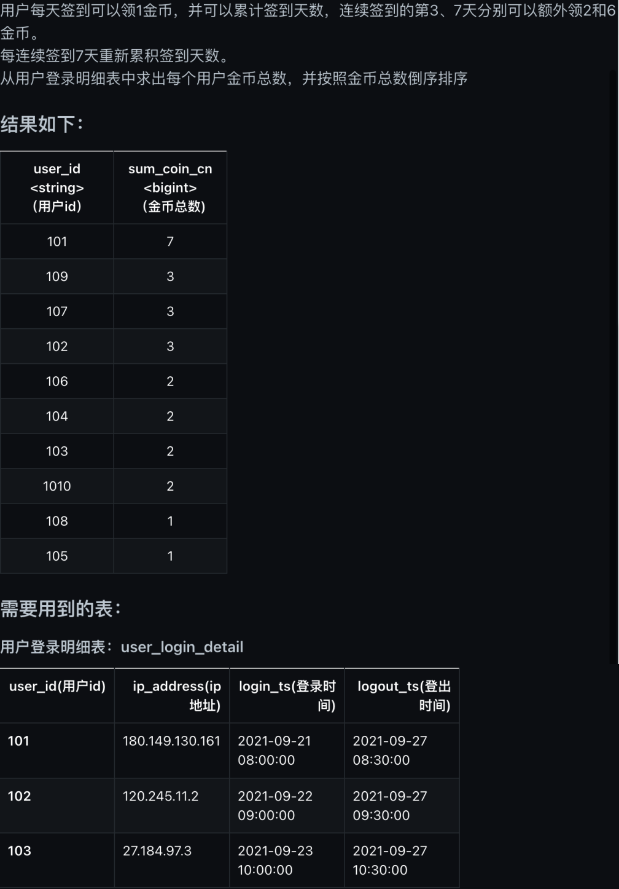
```sql
select 
	user_id
    ,sum(base+add3+add7) as sum_coin_cn
from (
  select 
      user_id
      ,cnt as base
      ,if(cnt>=3,2,0) as add3
      ,if(cnt>=7,6,0) as add7
  from (
    select 
        user_id,dt,count(dt)%7 as cnt
    from (
      select 
         user_id,login_dt,date_sub(login_dt,rk) as dt
      from (
        SELECT
            user_id,login_dt,rank() over(partition by user_id order by login_dt) as rk
        from (
          select 
              distinct user_id,date(login_ts) as login_dt
          from user_login_detail
        ) t1
      ) t2
    ) t3 
    group by user_id,dt 
  ) t4 
) t5
group by user_id
order by user_id
;
```
> 0039 国庆期间的7日动销率和滞销率

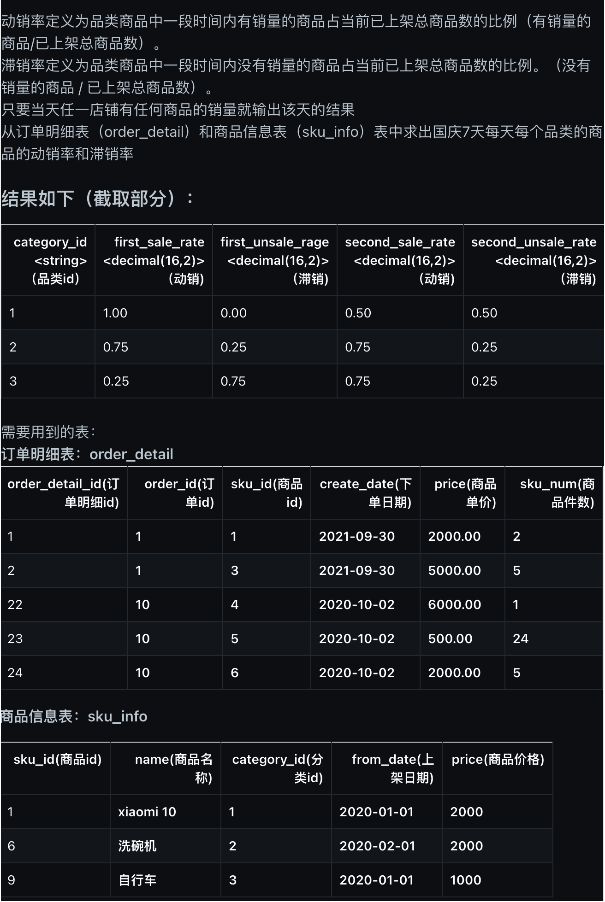
```sql
with sales as (
  select 
  	category_id
	,count(distinct if(create_date='2021-10-01',sku_id,null)) as cnt1
  	,count(distinct if(create_date='2021-10-02',sku_id,null)) as cnt2
    ,count(distinct if(create_date='2021-10-03',sku_id,null)) as cnt3
    ,count(distinct if(create_date='2021-10-04',sku_id,null)) as cnt4
    ,count(distinct if(create_date='2021-10-05',sku_id,null)) as cnt5
    ,count(distinct if(create_date='2021-10-06',sku_id,null)) as cnt6
    ,count(distinct if(create_date='2021-10-07',sku_id,null)) as cnt7
  from (
    select 
        category_id,o.create_date,o.sku_id
    from order_detail o join sku_info s on o.sku_id=s.sku_id
    where create_date between '2021-10-01' and '2021-10-07'
    group by category_id,o.create_date,o.sku_id
    having sum(sku_num)>0
  ) t1
  group by category_id
),
board as (
  select 
  	category_id
  	,count(distinct if(from_date<='2021-10-01',sku_id,null)) as cnt1
	,count(distinct if(from_date<='2021-10-02',sku_id,null)) as cnt2
	,count(distinct if(from_date<='2021-10-03',sku_id,null)) as cnt3
	,count(distinct if(from_date<='2021-10-04',sku_id,null)) as cnt4
	,count(distinct if(from_date<='2021-10-05',sku_id,null)) as cnt5
    ,count(distinct if(from_date<='2021-10-06',sku_id,null)) as cnt6
    ,count(distinct if(from_date<='2021-10-07',sku_id,null)) as cnt7
  from sku_info 
  where from_date<='2021-10-07'
  group by category_id
)

select 
	category_id
	,cast(first_sale_rate as decimal(16,2)) as first_sale_rate
    ,cast(1-first_sale_rate as decimal(16,2)) as first_unsale_rate
	,cast(second_sale_rate as decimal(16,2)) as second_sale_rate
    ,cast(1-second_sale_rate as decimal(16,2)) as second_unsale_rate
	,cast(third_sale_rate as decimal(16,2)) as third_sale_rate
    ,cast(1-third_sale_rate as decimal(16,2)) as third_unsale_rate
	,cast(fourth_sale_rate as decimal(16,2)) as fourth_sale_rate
    ,cast(1-fourth_sale_rate as decimal(16,2)) as fourth_unsale_rate
	,cast(fifth_sale_rate as decimal(16,2)) as fifth_sale_rate
    ,cast(1-fifth_sale_rate as decimal(16,2)) as fifth_unsale_rate
	,cast(sixth_sale_rate as decimal(16,2)) as sixth_sale_rate
    ,cast(1-sixth_sale_rate as decimal(16,2)) as sixth_unsale_rate
	,cast(seventh_sale_rate as decimal(16,2)) as seventh_sale_rate
    ,cast(1-seventh_sale_rate as decimal(16,2)) as seventh_unsale_rate
from (
  select 
      s.category_id
      ,s.cnt1/b.cnt1 as first_sale_rate
      ,s.cnt2/b.cnt2 as second_sale_rate
      ,s.cnt3/b.cnt3 as third_sale_rate
      ,s.cnt4/b.cnt4 as fourth_sale_rate
      ,s.cnt5/b.cnt5 as fifth_sale_rate
      ,s.cnt6/b.cnt6 as sixth_sale_rate
      ,s.cnt7/b.cnt7 as seventh_sale_rate
  from sales s join board b on s.category_id=b.category_id
) t1
;
```
> 0040 同时在线最多的人数

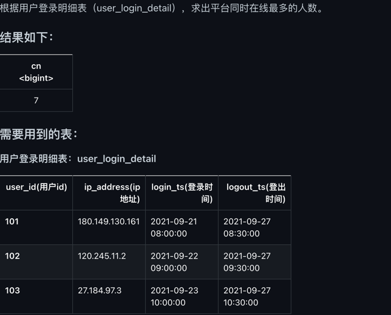
```sql
select 
	max(acc) as cn
from (
  select 
      user_id,ts,cnt
      ,sum(cnt) over(order by ts rows between unbounded preceding and current row) as acc
  from (
    select 
        user_id,login_ts as ts,1 as cnt
    from user_login_detail  -- 登录
    union 
    select 
        user_id,logout_ts as ts,-1 as cnt
    from user_login_detail  -- 退出
  ) t1
) t2;
```
