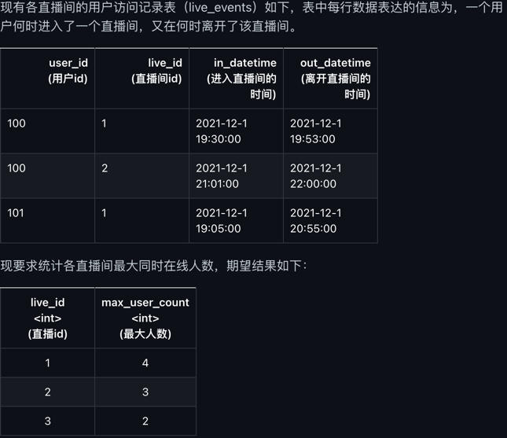
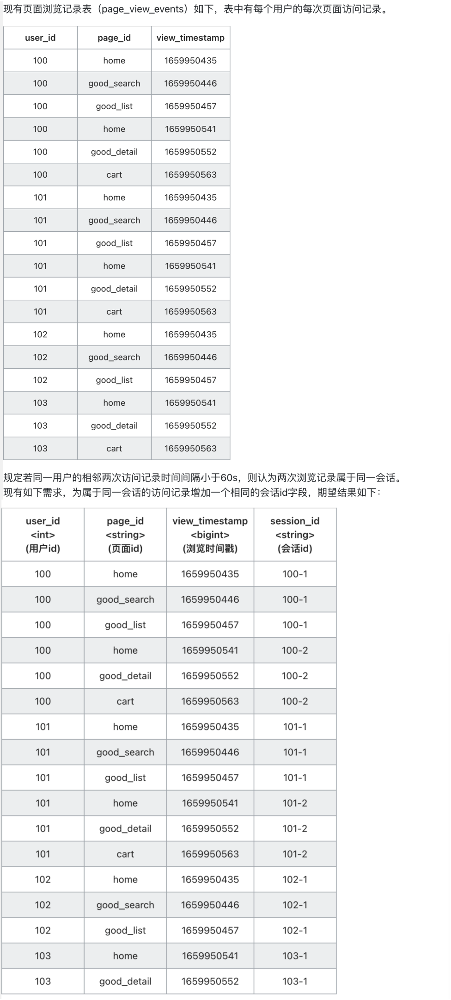
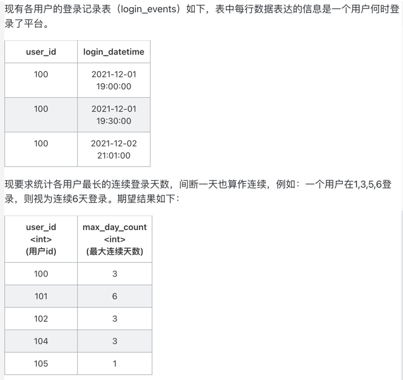
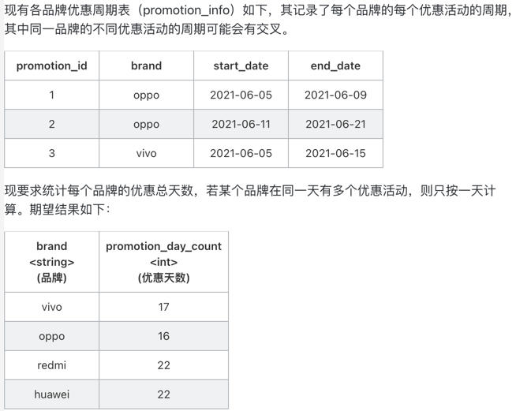
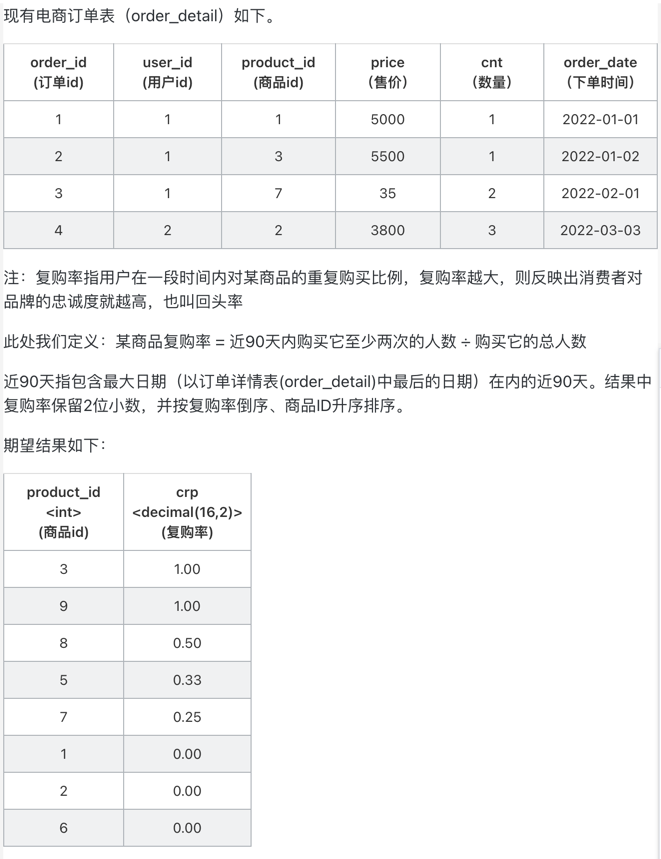
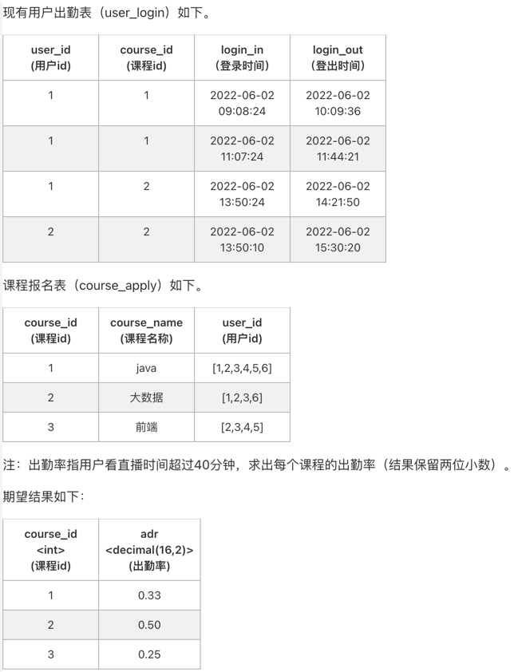
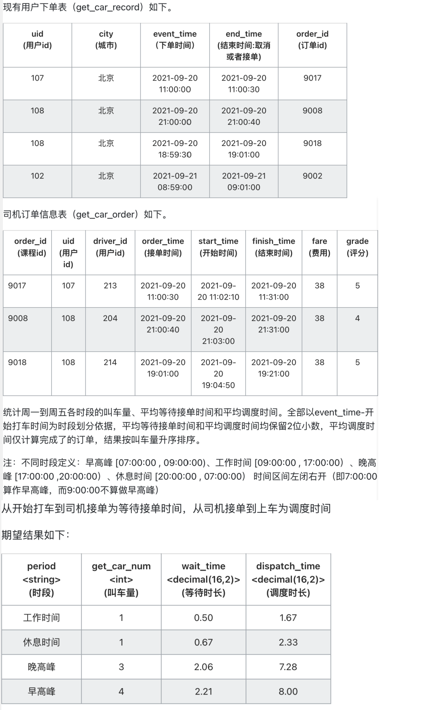
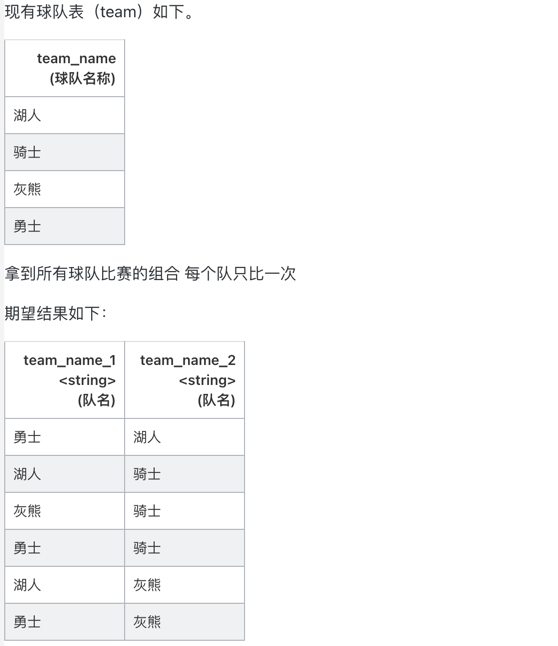
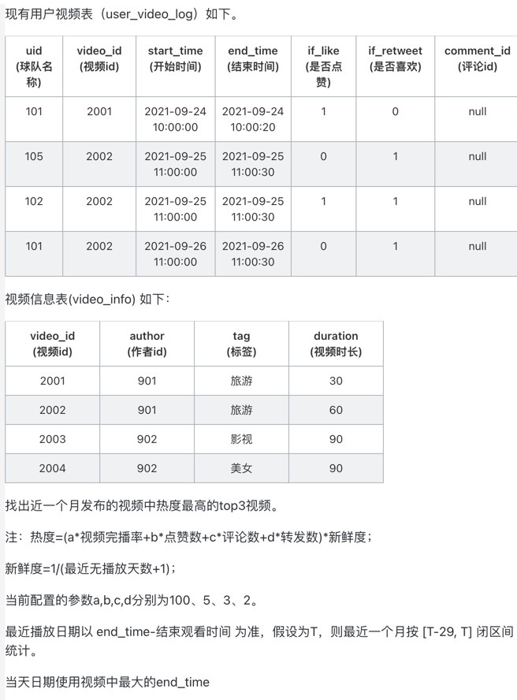
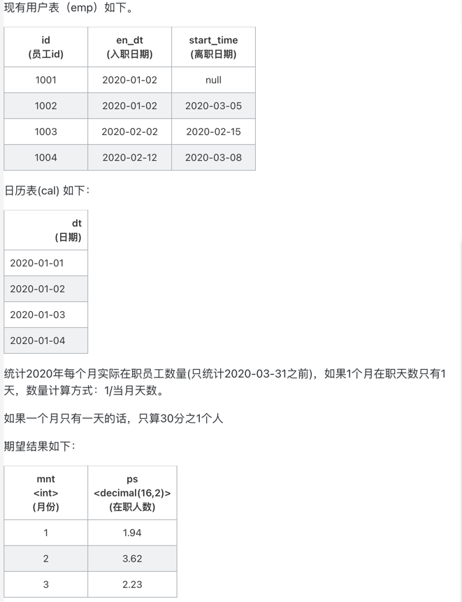

# 41~50 hive-sql例题

* 0041 同时在线最多的人数

```sql
select 
	live_id,max(acc) as max_user_count
from (
  select 
      user_id,live_id,ts
      ,sum(cnt) over(partition by live_id order by ts) as acc
  from (
    SELECT 
        user_id,live_id,in_datetime as ts,1 as cnt
    from live_events 
    union 
    SELECT 
        user_id,live_id,out_datetime as ts,-1 as cnt
    from live_events 
  ) t1
)t2
group by live_id
order by live_id;
```
* 0042 会话划分问题

```sql
with 
ranks as (
	select 
	     user_id,page_id,view_timestamp
	     ,lag(view_timestamp,1) over(partition by user_id order by view_timestamp) as prev_ts
	     ,rank() over(partition by user_id order by view_timestamp) as rk1
	     ,rank() over(partition by user_id order by view_timestamp desc) as rk2
	from page_view_events 
),
gaps as (
  select 
	  user_id,page_id,gap_end
  	  ,lag(gap_end,1,gap_end) over(partition by user_id order by gap_end) as prev_gap_end
      ,rank() over(partition by user_id order by gap_end) as rk
  from (
    select 
        user_id,page_id,view_timestamp as gap_end
    from ranks
    where view_timestamp - prev_ts>=60
    
    union all 
    
    select 
	    user_id,page_id,if(rk2=1,view_timestamp+1,view_timestamp) as gap_end
    from ranks
    where rk1=1 or rk2=1
    
  ) t2
)

select 
    e.user_id,e.page_id,e.view_timestamp
    ,concat(e.user_id,'-',g.rk-1) as session_id
from page_view_events e join gaps g on e.user_id=g.user_id 
and e.view_timestamp>=g.prev_gap_end and e.view_timestamp < g.gap_end
```
* 0043 间断连续登录用户问题

```sql
with logins as (
	select 
		distinct user_id,date(login_datetime) as login_dt
	from login_events 
),
ranges as (
  select 
      user_id,login_dt
  from ( 
    select 
        user_id,login_dt
        ,rank() over(partition by user_id order by login_dt) as rk1
        ,rank() over(partition by user_id order by login_dt desc) as rk2
    from logins
  ) t1
  where rk1=1 or rk2=1
),
gaps as (
  select 
  	user_id,login_dt
  from (
    select 
      user_id,login_dt
      ,lag(login_dt,1,login_dt) over(partition by user_id order by login_dt) as prev_dt
    from logins
  ) t1
  where datediff(login_dt,prev_dt)>2
)

select 
	user_id,max(diff) as max_day_count
from (
  select 
      user_id,datediff(login_dt,prev_dt)+1 as diff
  from (
    select 
        user_id,login_dt
        ,lag(login_dt,1,login_dt) over(partition by user_id order by login_dt) as prev_dt
    from (
      select * from ranges 
      union 
      select * from gaps
    ) t1
  ) t2
) t3
group by user_id
order by user_id
;
```
* 0044 日期交叉问题

```sql
with mark_cross as (
  select 
      brand,start_date,end_date,if(prev_max_end>=start_date,0,1) as not_cross -- 标记中断位置
  from (
    select 
        brand,start_date,end_date
        ,max(end_date) over(partition by brand order by start_date rows between unbounded preceding and 1 preceding) as prev_max_end
    from promotion_info
  ) t1
),
mark_cross_group as (
  select 
      brand,start_date,end_date
      ,sum(not_cross) over(partition by brand order by start_date) cross_group 
      -- 叠加中断次数，以此作为区段分界
  from mark_cross
)

select
	brand,sum(promotion_day_count) as promotion_day_count -- 汇总品牌下所有区段
from (
  select 
      brand,cross_group -- 一个区段上，计算最早和最晚间隔日期
      ,datediff(max(end_date),min(start_date)) + 1 as promotion_day_count
  from mark_cross_group
  group by brand,cross_group
) t1
group by brand;
```
* 0045 复购率问题

```sql
with curr as (
	select max(order_date) as today,date_sub(max(order_date),90) as ago90 from order_detail
),
sales as (
  select 
      product_id,user_id,count(distinct order_id) as buy_count
  from (
    select 
        product_id,user_id,order_id,order_date,today,ago90
    from order_detail corss join curr
  ) t1
  where order_date>=ago90 and order_date <=today
  group by product_id,user_id
),
agains as (
  select 
  	product_id,count(distinct user_id) as uv
  from sales
  where buy_count>=2
  group by product_id
),
buys as (
  select 
  	product_id,count(distinct user_id) as uv
  from sales
  group by product_id
)

select 
	b.product_id,cast(nvl(a.uv,0)/b.uv as decimal(16,2)) as cpr
from agains a full join buys b on a.product_id=b.product_id
order by cpr desc,b.product_id asc
;
```
* 0046 出勤率问题

```sql
with attends as (
  select 
      user_id,course_id,sum(mins) as mins_sum
  from (
    select 
        user_id,course_id,(unix_timestamp(login_out) - unix_timestamp(login_in))/60 as mins
    from user_login
  ) t1
  group by user_id,course_id
),
totals as (
  select 
      course_id,count(uid) as uv
  from course_apply lateral view explode(user_id) temp as uid
  group by course_id
),
over40 as (
  select 
      course_id,count(user_id) as uv
  from attends
  where mins_sum>40
  group by course_id
)

select 
	t.course_id,cast(nvl(o.uv,0)/t.uv as decimal(16,2)) as adr
from over40 o full join totals t on o.course_id=t.course_id
;
```
* 0047 打车问题

```sql
with time_range as (
	select '早高峰'   as period,'07:00:00' as low,'09:00:00' up union
	select '工作时间' as period,'09:00:00' as low,'17:00:00' up union  
  	select '晚高峰'   as period,'17:00:00' as low,'20:00:00' up union  
  	select '休息时间' as period,'20:00:00' as low,'24:00:00' up union 
    select '休息时间' as period,'00:00:00' as low,'07:00:00' up 
),
rides as (
  select 
      order_id,etime,period
  	  ,event_time,order_time,start_time
      ,unix_timestamp(order_time) - unix_timestamp(event_time) as wait_time
      ,unix_timestamp(start_time) - unix_timestamp(order_time) as dispatch_time
  from 
  (
    select 
        rec.order_id
    	,split(rec.event_time,' ')[1] as etime 
        ,rec.event_time -- 开始打车
    	,ord.order_time --接单时间
        ,ord.start_time -- 上车时间
    from get_car_record rec
    full join get_car_order ord 
    on rec.order_id=ord.order_id
  ) r join time_range t
  on r.etime>=t.low and r.etime<t.up
)

select 
	period
	,count(order_id) as get_car_num
    ,cast(avg(wait_time)/60 as decimal(16,2)) as wait_time
    ,cast(avg(dispatch_time/60) as decimal(16,2)) as dispatch_time
from rides
group by period
order by get_car_num
;
```
* 0048 排列问题

```sql
select 
	t1.team_name as team_name_1
	,t2.team_name as team_name_2
from team t1 join team t2
on t1.team_name<t2.team_name
;
```
* 0049 视频热度问题

```sql
with curr as (
  select 
    max(date(end_time)) as today
    ,date_sub(max(date(end_time)),29) as ago30 
  from user_video_log
),
play_info as (
   select 
       u.video_id
       ,u.start_time
       ,u.end_time
       ,if_like
       ,if_retweet
       ,comment_id
       ,v.duration
       ,if((unix_timestamp(u.end_time) - unix_timestamp(u.start_time)) >= v.duration,1,0) as is_complete
       ,c.today
       ,c.ago30
   from user_video_log u 
   join video_info v on u.video_id=v.video_id
   join curr c on date(u.end_time) >=c.ago30 and date(u.end_time)<=c.today
)

select
  video_id
  ,cast((100*complete_ratio+5*like_count+3*comment_count+2*retweet_count)/(noplay_days+1) as decimal(16,2)) as heat
from (
  select 
      video_id
      ,sum(is_complete)/sum(1) as complete_ratio
      ,sum(if_like) as like_count
      ,count(comment_id) as comment_count
      ,sum(if_retweet) as retweet_count
      ,min(datediff(today,end_time)) as noplay_days
  from play_info
  group by video_id
) tt
;
```
* 0050 员工在职人数问题

```sql
with mon as (
	select month(dt) mnt,count(dt) as cnt 
    from cal 
    where dt>='2020-01-01' and dt<='2020-03-31'
    group by month(dt)
),
att as (
  select 
      id,mnt,count(1) as cnt
  from (
    select 
        e.id,month(c.dt) as mnt
    from emp e join cal c 
    on e.en_dt<=c.dt and c.dt<=nvl(e.le_dt,'2020-04-01')
    where c.dt>='2020-01-01' and c.dt<='2020-03-31'
  ) t1
  group by id,mnt
)

select 
	m.mnt as mth,cast(sum(a.cnt/m.cnt)as decimal(16,2)) as ps
from mon m left join att a on m.mnt = a.mnt
group by m.mnt
;
```
